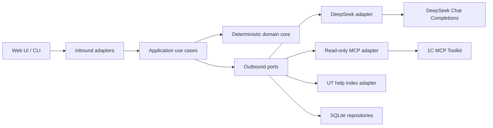

# Архитектура MVP ChatBot 1C v7

Статус: проектное решение для реализации с нуля. Код и архитектура версии 5 не
использовались. Целевая система: `УправлениеТорговлейБазовая` 11.5.27.56,
режим совместимости 8.3.27, один процесс приложения на одну информационную базу.
Acceptance baseline архитектуры включает все `Q001-Q116`, в том числе принятые
руководителем десять end-to-end сценариев `Q107-Q116`.

## 1. Цели и инварианты

Архитектура должна дать быстрый локальный MVP и не создавать кодовую ветвь под
каждый вопрос или объект УТ. Инварианты системы:

1. DeepSeek никогда не получает возможность отправить произвольный запрос в 1С.
2. В runtime выполняется только текст фиксированного query template из принятой
   ревизии навыка; пользовательские значения передаются как параметры.
3. DeepSeek возвращает только типизированную интерпретацию, уточнение или DAG
   готовых навыков и разрешенных операторов.
4. До выполнения детерминированный валидатор доказывает покрытие требуемых
   фактов, совместимость типов, единиц, времени и ссылочных объектов.
5. После выполнения ответ разрешен только при достаточном evidence-контракте.
6. `success_empty`, нулевой агрегат и техническая ошибка являются разными
   состояниями.
7. Каталог навыков неизменяем в пределах обращения. Импорт создает следующую
   immutable-ревизию и не влияет на уже начатые обращения.
8. Через MCP разрешены только `execute_query` и `get_metadata`. Ни один endpoint
   или tool для исполнения BSL, изменения объекта либо управления сеансом не
   подключается к application port.
9. Обычный ответ не показывает capability/skill IDs, query text или сырой MCP
   response. Они доступны в details/diagnostics; экспорт навыка по определению
   содержит его фиксированный query template.
10. Пользовательский UI и ответы русскоязычные. Авторизация не входит в MVP,
    поэтому сервер по умолчанию слушает только `127.0.0.1`.
11. Acceptance marker имеет scope `acceptance_observable_state` и включает
    digest контрольных проекций/агрегатов suite, configuration/profile,
    catalog и documentation revisions. Он не доказывает неизменность всей ИБ.
12. Documentation schema v1 допускает только встроенную справку. Внешний
    `source_kind` отклоняется, а расхождения между найденными фрагментами
    встроенного корпуса показываются раздельно с цитатой для каждой позиции.

## 2. Архитектурный стиль

Используется модульный монолит с портами и адаптерами. Это уменьшает стоимость
MVP, но сохраняет границы, по которым впоследствии можно вынести индексатор,
LLM gateway или исполнение планов в отдельные процессы.



Направление compile-time зависимостей строго одно:

`web/cli -> application -> domain`

`infrastructure/adapters -> application ports + domain`

`bootstrap -> все модули только для сборки dependency graph`

`domain` не импортирует FastAPI, SQLAlchemy, MCP SDK, HTTP client или DeepSeek
client. `application` не импортирует конкретные адаптеры. Циклические импорты и
обратные вызовы из domain в web запрещены.

## 3. Слои и обязанности

### 3.1. Domain

- типы `FactRequirement`, `Fact`, `EntityRef`, `Period`, `Money`, `Quantity`;
- состояния выполнения и правила переходов;
- модели навыка, query template, semantic output contract и плана;
- проверка DAG, типов bindings, совместимости единиц и времени;
- проверка покрытия фактов до выполнения и достаточности evidence после него;
- детерминированные операторы `normalize_period`, `count`, `aggregate`, `rank`,
  `filter`, `join`, `calculate`;
- политика read-only и допустимый список MCP tools;
- проверка ссылок в documentation disagreements и запрет скрытого выбора позиции;
- построение renderer manifest из подтвержденных фактов.

Domain не знает формулировок конкретных вопросов. Названия товара, склада,
характеристики, серии и назначения являются значениями типизированных
параметров, а не классами или ветвями кода.

### 3.2. Application

- `HandleMessage`: полный orchestration одного обращения;
- `PlanRequest`: создание shortlist, вызов DeepSeek и валидация плана;
- `ExecutePlan`: topological execution с общим deadline;
- `BuildAnswer`: evidence manifest, grounded LLM summary и renderer;
- `ContinueConversation`: разрешение context handles и pending clarification;
- `ImportSkillPackage`, `ReplaceSkill`, `DeleteSkill`, `ExportSkill`;
- `BuildDocumentationIndex`, `CaptureDatabaseMarker`;
- `GetHealth`, `ExportDiagnosticBundle`, `ClearStoredData`;
- транзакционные границы, idempotency и pinning catalog/context revisions.

Application обращается к внешнему миру только через порты:
`PlannerPort`, `AnswerWriterPort`, `ReadOnly1CPort`, `DocumentationPort`,
`SessionRepository`, `TraceRepository`, `CatalogRepository`, `Clock`.

### 3.3. Adapters / infrastructure

- DeepSeek Chat Completions adapter;
- MCP Streamable HTTP adapter и нормализатор известных envelope-вариантов;
- SQLite/SQLAlchemy repositories и migrations;
- парсер `Ext/Help/ru.html`, индекс FTS5 и citation resolver;
- JCS/RFC 8785 canonicalization, SHA-256, JSON Schema validation;
- structured logging, redaction и сборка diagnostic ZIP;
- системные часы, UUIDv7/UUID4 generator и файловые операции.

### 3.4. Inbound web и CLI

Web принимает сообщения, показывает историю, progress, health, details и
управляет навыками. CLI использует те же application use cases для файлового
импорта/экспорта, проверки пакета, перестроения help index, marker и диагностики.
Ни web, ни CLI не обращаются к SQLite, MCP или DeepSeek напрямую.

## 4. Границы понятий

| Понятие | Граница | Что им не является |
| --- | --- | --- |
| Product capability | Стабильное обещание продукта `CAP-*`, используемое требованиями и тестами | Не класс, endpoint, query и не обязательно один навык |
| Atomic skill | Переносимая декларация одной операции источника с параметрами и semantic output contract | Не готовый ответ на конкретную фразу и не многошаговый workflow |
| Composite plan | DAG вызовов atomic skills и небольшого allowlist детерминированных операторов для одного обращения | Не сохраняемый новый навык и не произвольный код модели |
| Query template | Неизменяемый параметризованный текст языка запросов 1С внутри data-query skill | Не генерируется и не редактируется DeepSeek в runtime |
| Documentation retrieval operation | Декларативная политика поиска по конкретному help index, source filters и ожидаемым chunk roles | Не data query и не свободный web search |
| Renderer | Детерминированное преобразование validated evidence в scalar/table/list/timeline/procedure blocks | Не источник фактов и не место для бизнес-вычислений |

Один capability может обеспечиваться общим механизмом, одним навыком или
композицией. Например, `CAP-COMMON-RANK` реализует один оператор `rank`, а
`CAP-SETTLEMENT-BY-DOCUMENT` может требовать data-query skill плюс передачу
подтвержденного document ref. Один atomic skill может декларировать несколько
`CAP-*` только если одна и та же операция и один output contract действительно
обеспечивают их без дополнительной скрытой логики.

## 5. Небольшое число устойчивых механизмов

87 capability IDs каталога реализуются следующими семействами:

1. Query execution: фиксированный template, typed bindings, exact column map.
2. Entity resolution: семейство query skills с единым `EntityRef` контрактом.
3. Period normalization: один оператор на времени обращения и timezone.
4. Relational composition: count/aggregate/rank/filter/join/calculate.
5. Context ledger: подтвержденные facts и object refs с opaque handles.
6. Clarification: missing/ambiguous slots и один конкретный вопрос.
7. Documentation retrieval: один index engine, declarative role/filter contracts
   и единая политика показа расхождений с несколькими цитатами.
8. Outcome/evidence validation: единая state machine и coverage checker.
9. Rendering: ограниченный набор generic renderers.
10. Catalog transaction: единый import/replace/delete protocol.

Новый товарный разрез, характеристика, серия или назначение добавляется в
parameter/output contract и query template навыка. Код механизма не меняется.

## 6. Граница DeepSeek и детерминированного ядра

DeepSeek разрешено:

- определить intent, required facts и typed slots;
- выбрать навыки только из переданного shortlist и версии pinned catalog;
- построить план только по `planner-output.schema.json`;
- сформулировать один clarification;
- подготовить русскоязычный summary с references на evidence IDs.

DeepSeek запрещено:

- возвращать query text, имя таблицы/поля 1С или MCP tool arguments;
- создавать или изменять skill в пользовательском runtime;
- передавать GUID/`_objectRef`, которого нет в context или evidence;
- объявлять покрытие достаточным;
- вычислять суммы, рейтинги, даты или валюты, если это делает core;
- добавлять факт или инструкцию без evidence reference.

Детерминированное ядро формирует shortlist, валидирует JSON, разрешает handles,
проверяет coverage, связывает параметры, выполняет template, классифицирует
outcome, валидирует типы и достаточность, выполняет вычисления и рендерит
авторитетные значения. Ошибка LLM никогда не расширяет полномочия модели.

## 7. Выбор технологического стека

| Область | Выбор MVP | Причина |
| --- | --- | --- |
| Runtime | Python 3.12 | Один код на macOS/Windows, зрелые JSON/HTTP/SQLite библиотеки |
| Web/API | FastAPI + Uvicorn | OpenAPI, async I/O, SSE, multipart import |
| Validation | Pydantic v2 + `jsonschema` Draft 2020-12 | Runtime DTO и переносимые стандартизованные schemas |
| Persistence | SQLite WAL + SQLAlchemy 2 + Alembic | Один локальный процесс, транзакции, FTS5, простой backup |
| HTTP | `httpx` | Deadlines, retry policy и async streaming |
| MCP | официальный Python MCP client, Streamable HTTP | Использование `/mcp`, а не собственная трактовка протокола |
| UI | server-rendered Jinja2 + небольшой ES module + SSE | Нет обязательного Node toolchain, достаточно для локального MVP |
| Help search | SQLite FTS5 + детерминированная русская token/stem normalization | Локальный переносимый индекс с фильтрами и цитатами |
| Packaging | `venv`/wheel, lock-файл зависимостей | Воспроизводимость macOS и Windows |
| Tests | pytest, pytest-asyncio, respx, Playwright | Unit, contracts, API и browser acceptance |

### Отклоненные альтернативы

- Микросервисы: отклонены из-за лишней поставки, сетевых отказов и отсутствия
  требования к нагрузке; порты сохраняют будущий путь выделения.
- PostgreSQL: отклонен для однопроцессного локального MVP; SQLite дает нужные
  транзакции и FTS. Миграция возможна через repository ports.
- React/Vite: отклонен в первом срезе из-за второго build toolchain. При росте UI
  API остается независимым.
- Vector-only search: отклонен как непрозрачный единственный критерий. FTS,
  metadata filters, fact contracts и coverage proof дают проверяемый путь.
- Полностью детерминированный NLP: не покрывает естественные перефразировки и
  составные вопросы без разрастания классификаторов.
- Runtime query synthesis: отклонен как прямой источник выдуманных метаданных и
  семантически неверных запросов.

## 8. Предлагаемая структура каталогов

```text
src/chatbot1c/
  domain/                 # facts, refs, plans, outcomes, contracts, operators
  application/            # use cases and outbound ports
  adapters/
    deepseek/             # planner and grounded answer adapters
    mcp/                  # read-only MCP and envelope normalization
    help_index/           # parser, index, retrieval, citations
    persistence/          # SQLAlchemy repositories and migrations
    diagnostics/          # trace writer, redaction, bundle export
  web/                    # FastAPI routes, DTO, Jinja views, static assets
  cli/                    # commands over application use cases
  bootstrap.py            # composition root only
schemas/                  # portable contracts from this design
skill-packages/           # shipped package, versioned separately
tests/
  unit/
  contract/
  integration/
  corpus/                 # acceptance Q001-Q116
  browser/
scripts/                  # index, marker, baseline and package validation entrypoints
```

## 9. Конфигурация окружения

Минимальные переменные:

| Переменная | Default / правило |
| --- | --- |
| `APP_HOST` | `127.0.0.1`; внешнее bind требует явной настройки |
| `APP_PORT` | `8000` |
| `APP_DATA_DIR` | platform-specific user data dir, не каталог Git |
| `DATABASE_URL` | SQLite file в `APP_DATA_DIR` |
| `DEEPSEEK_BASE_URL` | `https://api.deepseek.com` |
| `DEEPSEEK_MODEL` | `deepseek-chat` |
| `DEEPSEEK_API_KEY` | обязательно из environment, никогда не логируется |
| `MCP_URL` | `http://127.0.0.1:6003/mcp` |
| `MCP_CHANNEL` | `default` или явно заданный channel |
| `UT_CONFIG_DIR` | путь к целевой файловой выгрузке |
| `TARGET_CONFIGURATION_ID` | `УправлениеТорговлейБазовая` |
| `TARGET_RELEASE` | `11.5.27.56` |
| `TARGET_COMPATIBILITY_MODE` | `8.3.27` |
| `DEFAULT_LIST_LIMIT` | `20` |
| `MAX_MCP_ROWS` | не более `1000` на вызов |
| `REQUEST_DEADLINE_SECONDS` | `90`; базовый SLO отдельно 30 секунд |
| `LOG_LEVEL` | `INFO`, без raw payload в обычном логе |

Пути обрабатываются через `pathlib`; конфигурация не содержит разделителей,
специфичных для ОС. На Windows сервис запускается тем же wheel/venv и получает
пути через environment или `.env.local`, исключенный из Git.

## 10. Расширение после MVP

- новая версия УТ поставляется отдельным package с другим compatibility range и
  metadata assertions;
- новый источник документации требует новой версии schema/adapter, а не
  неявного смешения с help corpus;
- новый deterministic operator добавляется только после отдельного контракта и
  набора unit/property tests;
- multi-database режим добавляет tenant/database key во все ports и persistence,
  но не меняет skill semantics;
- аутентификация добавляется на inbound boundary; domain core остается прежним.

Связанные документы: [request lifecycle](request_lifecycle.md),
[skill contract](skill_contract.md), [integration contracts](integration_contracts.md),
[persistence and observability](persistence_and_observability.md),
[implementation slices](implementation_slices.md).
