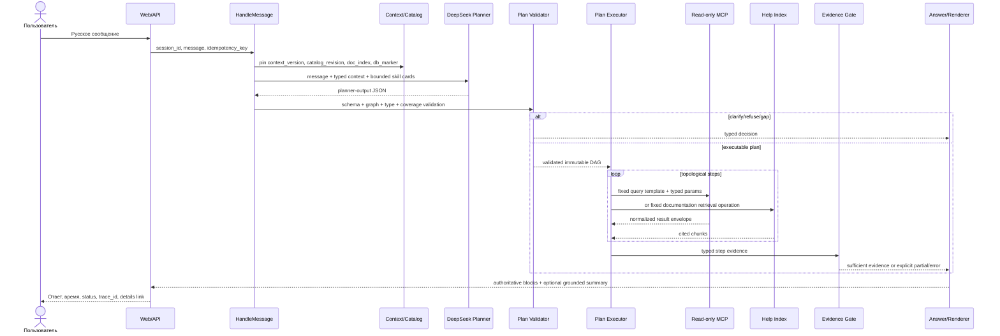

# Жизненный цикл пользовательского запроса

Этот документ задает полный путь от web-сообщения до доказуемого ответа. Все
шаги имеют trace event, входной/выходной contract и конечный deadline.

## 1. Последовательность



## 2. Стадии и транзакционные точки

### 2.1. Прием

`POST /api/v1/sessions/{session_id}/messages` принимает:

```json
{
  "text": "Покажи остатки курток на розничных складах",
  "client_message_id": "018f...",
  "expected_context_version": 7
}
```

API проверяет размер/UTF-8, создает `request_id`, `trace_id`, turn и user message
в одной SQLite transaction. Повтор того же `client_message_id` возвращает
существующий turn. Ответ API: `202 Accepted` с `turn_id`, после чего UI получает
progress через SSE. Ввод остается доступным; для одной сессии выполнение turns
сериализуется, разные сессии могут обрабатываться параллельно.

### 2.2. Pinning состояния

В начале turn фиксируются:

- `session_context_version` и pending clarification, если есть;
- immutable `catalog_snapshot_id/revision` и точные skill versions/checksums;
- версия help index и corpus digest;
- последний проверенный `acceptance_observable_state` marker с revision/digest
  configuration profile, catalog snapshot, documentation index и контрольных
  проекций/агрегатов acceptance suite;
- `turn_time` и timezone `Europe/Moscow`.

Импорт/замена навыка после этой точки виден только следующему turn. Если клиент
прислал устаревший context version, запрос не исполняется: возвращается
`409 CONTEXT_VERSION_CONFLICT`, UI перечитывает сессию и предлагает повтор.

### 2.3. Построение контекста

Planner получает не сырой transcript и не raw MCP, а ограниченный контекст:

```json
{
  "confirmed_facts": [
    {
      "handle": "ctx_01J...",
      "semantic_type": "document.sales_order",
      "presentation": "Заказ 0000-000005 от 12.02.2025",
      "origin_turn_id": "..."
    }
  ],
  "active_filters": [
    {"handle": "ctx_01K...", "semantic_type": "warehouse.kind.retail"},
    {"handle": "ctx_01L...", "semantic_type": "time.moment"}
  ],
  "pending_clarification": null,
  "recent_user_messages": ["..."],
  "context_version": 7
}
```

Полный `_objectRef` хранится в core и не требуется модели. DeepSeek может только
вернуть существующий handle; resolver проверяет его принадлежность сессии,
semantic type и актуальность. Новый mention товара остается text slot и должен
пройти entity-resolution skill.

### 2.4. Shortlist навыков

Shortlist формируется до planner call как объединение независимых сигналов:

1. intent/source boundary (`data`, `documentation`, `mixed`);
2. alias/examples BM25 с учетом опечаток;
3. declared produced fact types;
4. compatible input types и уже доступные context facts;
5. applicability и anti-examples;
6. target compatibility и active catalog revision.

Текстовая близость дает только recall и никогда не подтверждает выбор. В prompt
передается не query text, а card: skill ID/version, purpose, typed inputs,
produced facts, limitations и dependencies. Максимум shortlist задается
конфигурацией (рекомендуется 16). Если validator обнаружил недостающий fact type,
разрешено одно расширение shortlist через fact index и один повтор планирования.

### 2.5. Планирование DeepSeek

DeepSeek возвращает только JSON по `schemas/planner-output.schema.json`:

- `execute`: DAG skill/operator calls;
- `clarify`: один конкретный вопрос и до пяти вариантов;
- `refuse`: только `read_only_request` или `out_of_scope`;
- `capability_gap`: перечень отсутствующих semantic fact types.

В schema отсутствуют query, table, column, MCP tool arguments и произвольный
код. JSON parse/schema error допускает один repair call с кратким списком
validation errors. Вторая ошибка становится `llm_unavailable/contract_error`.

### 2.6. Проверка плана до выполнения

`PlanValidator` повторно, без доверия к утверждениям модели, проверяет:

1. request/context/catalog versions совпадают с pinned snapshot;
2. все skill IDs и версии есть в snapshot и совместимы с базой;
3. каждый binding существует, разрешен parameter contract и совпадает по типу;
4. entity-ref приходит только из context или предыдущего validated step;
5. все ссылки направлены на более ранний step, IDs уникальны, циклов нет;
6. operator входит в allowlist, его operands и units совместимы;
7. для каждого required fact существует producer с нужной cardinality, unit и
   time semantics;
8. required inputs producer-ов доступны из slots/context/предыдущих steps;
9. final outputs покрывают все обязательные requirements;
10. data/documentation boundaries не смешаны без явного mixed plan;
11. list skill имеет pagination contract, default page size 20;
12. неиспользуемые или дублирующие steps отклоняются.

Результат проверки - `CoverageProof`, построенный core. Если не хватает
пользовательского значения, выполняется clarification. Если отсутствует
producer, возвращается capability gap. Никакой MCP call до успешного proof нет.

### 2.7. Required/optional closure

Required/optional является вычисляемым свойством validated DAG, а не полем
planner step. `planner-output.schema.json` v1 не меняется: отдельный флаг на
`skill_call` был бы дублирующим, не покрывал бы operator steps и мог бы
противоречить dependencies.

`PlanValidator` строит criticality до выполнения:

1. Canonical step graph содержит edge `consumer -> producer` для каждого
   `binding.source=step` и каждого declared operator input (`input_step_id`,
   `left_step_id`, `right_step_id`). Порядок `result.steps` обязан быть
   topological и служит tie-break.
2. Каждый `final_outputs[*]` сопоставляется ровно с одним
   `interpretation.required_facts[*]` по полному fact signature: semantic/value
   type, cardinality, unit, time и declared identity coordinates. Каждый
   `required=true` requirement обязан иметь ровно один final output; optional
   requirement может иметь ноль или один.
3. Unclaimed final output, два final outputs для одного requirement, duplicate
   requirements с одинаковой signature и разной criticality, execute plan без
   `required=true` requirement и неоднозначное сопоставление отклоняются до
   внешних calls. Альтернативный producer planner обязан выбрать до execution.
4. `required_roots` - steps final outputs обязательных requirements.
   `required_closure` - эти roots и все их transitive predecessors.
5. `all_closure` строится тем же способом от всех required и optional final
   outputs. Step является `required`, если входит в `required_closure`, иначе
   `optional`, если входит только в `all_closure`. Любой step вне `all_closure`
   дает `PLAN_STEP_UNUSED`.

Общий predecessor required и optional roots всегда required. Поэтому step,
который кажется optional, но поставляет parameter или operator input в required
branch, автоматически required. `left` join не делает right input optional:
оба input входят в closure required join result. Optional enrichment должен
быть отдельным optional final branch. `on_empty` управляет только valid empty
result и не меняет criticality.

`CoverageProof` сохраняет для каждого step `criticality`, canonical predecessors
и `required_by_requirement_ids`; во время execution criticality не
пересчитывается и не понижается после успеха другой ветви.

Proof также сохраняет каждое planner requirement ровно один раз по
`requirement_id`, включая исходный boolean `required`. Evidence не выводит
criticality обратно из наличия final output и не использует schema default.

## 3. Исполнение плана

### 3.1. Skill call

Executor загружает skill из pinned snapshot, разрешает bindings и строит MCP
arguments только из query template и его parameter map. Подстановка строк в
query text запрещена. `like_contains` формирует значение параметра `%...%`, а не
фрагмент запроса. `_objectRef` передается в формате MCP без преобразования в
presentation или поиска по имени.

MCP получает только:

```json
{
  "query": "<exact text from accepted skill revision>",
  "params": {"Номенклатура": {"_objectRef": true, "...": "..."}},
  "limit": 21,
  "include_schema": true
}
```

`21` означает 20 отображаемых строк плюс probe наличия продолжения. Query text,
params и raw response записываются в защищенную diagnostic payload, но не в
обычный application log или chat response.

### 3.2. Documentation retrieval

Documentation skill вызывает локальный индекс с фиксированным corpus,
retrieval engine, filters, top-k и ожидаемыми chunk roles. Результат содержит
текст chunk и citation с `ut-help://11.5.27.56/...#anchor`.

Schema и adapter v1 принимают только `source_kind=built_in_help`; любое другое
значение отклоняется до retrieval. Если grounded consistency pass находит разные
позиции в нескольких фрагментах встроенного корпуса, он возвращает только
ссылки на fact/citation IDs. Core проверяет минимум две разные citations и
создает `documentation_disagreements`; renderer показывает каждую позицию и ее
источник отдельно, не выбирая одну версию как истинную без evidence.

### 3.3. Детерминированные операторы

Операторы принимают только typed facts. `rank` требует measure и направление;
`aggregate` сохраняет unit; `join` соединяет только совместимые identity keys;
`calculate` проверяет размерности и деление на ноль. Каждый производный факт
содержит provenance на исходные fact instance IDs.

`count` не расширяет вход и не запускает pagination. Он считает distinct facts,
фактически присутствующие в одном `input_step_id`, по обязательному
`distinct_by_fact_ids`. Core выводит scope результата из producer contract, а
не из выбранного planner-ом `result_fact_id`:

- `page_is_complete`, keyset page и отдельная continuation page имеют
  `collection_scope=visible_page`; даже `has_more=false` у последней страницы
  не превращает только эту страницу в полное множество;
- `collection_scope=complete_set` имеют только непагинируемый complete-set
  producer, полностью материализованный proved-prefix set либо отдельный
  aggregate/full-set producer;
- count над `visible_page` может закрыть только requirement видимого количества
  и отображается как `Показано N`; он не совместим с semantic requirement
  общего количества;
- count над `complete_set` может закрыть total requirement и отображаться как
  `Всего N`.

Scope является core-derived частью fact signature/CoverageProof и не требует
нового planner field. Попытка сопоставить page-scoped count с total requirement
отклоняется до MCP как `PLAN_COUNT_SCOPE_MISMATCH`. Для документов distinct key
обязан содержать document identity; число строк/позиций не считается числом
документов. Нормализованный StepEvidence обязан явно содержать scope; отсутствие
поля не означает `complete_set`.

### 3.4. Ссылочные объекты

Каноническая identity 1С:

```json
{
  "_objectRef": true,
  "УникальныйИдентификатор": "a1b2c3d4-e5f6-7890-abcd-ef1234567890",
  "ТипОбъекта": "ДокументСсылка.ЗаказКлиента",
  "Представление": "Заказ клиента 0000-000005"
}
```

Typed business identity определяется тройкой
`(semantic_type, ТипОбъекта, УникальныйИдентификатор)`.
`Представление` только отображается и не участвует в равенстве.

Semantic и physical type не выводятся из application-словаря или префикса.
Previous-step fact либо context handle восстанавливает исходный confirmed fact;
его semantic type сверяется с parameter contract, а `ТипОбъекта` - с
`accepted_mcp_types` exact producer column binding по сохраненному evidence и
pinned catalog snapshot. Context хранит `origin_fact_instance_id`. Raw
структурная ссылка из LLM/user slot запрещена, поэтому договор нельзя передать в
parameter клиента даже при похожем представлении.

После успешного ответа только факты, одновременно разрешенные portable
context-export policy и core-derived proof, получают opaque handle и атомарно
меняют context ledger. Entity требует `selected_only` и SelectionProof; наличие
ref в candidate, list/detail/final row само по себе export не разрешает. Typed
scalar/filter требует отдельный `confirmed_filter` и FilterRetentionProof с exact
value type, origin parameter source, Evidence locator и compatible consumer. Для
selected set один handle группирует exact origin facts только при `complete_set`;
keyset page скрыто не drain-ится. Follow-up заменяет только exact declarative
slot key; остальные active values, включая canonical moment bytes, сохраняются
без повторного вычисления.

Clarification создает persisted typed one-use state, связанный с исходным
turn/plan/requirements и exact choices. Candidate выбирается только по этому
state; recent messages и LLM similarity не являются resolver-ом. Полная
0/1/N, slot и resume semantics зафиксированы в
`docs/testing/slice3_acceptance_contract.md`.

### 3.5. Порядок исполнения criticality closure

Executor сначала выполняет `required_closure` в topological порядке с исходным
индексом step как tie-break. Optional-only steps запускаются только после того,
как все required final requirements получили sufficient coverage.

- required `contract_error` немедленно запрещает запуск новых steps и
  доминирует над уже собранными facts;
- required `query_error`/dependency failure помечает transitive descendants
  `blocked`, но executor продолжает независимые required branches;
- после любого required query/dependency failure optional-only closure не
  запускается;
- optional failure любого типа discard-ит response, блокирует только его
  optional descendants и не останавливает независимые optional branches;
- blocked descendant не создает новый error и наследует root failure для
  coverage diagnostics.

Valid empty required step не считается failure. `stop_not_found` завершает
plan как `success_empty` и не запускает optional-only closure;
`continue_as_empty_set`/`continue_as_zero_only_if_contract_allows` продолжают
только по объявленной empty policy, не меняя criticality.

Таким образом required query failure может завершиться `partial` после
успешной независимой required branch, а optional contract violation не может
изменить достаточный success.

## 4. Нормализация исходов

| Состояние | Условие | Пользовательское поведение |
| --- | --- | --- |
| `success_with_rows` | `success=true`, есть строки, schema и required facts валидны | Показать подтвержденные данные |
| `success_empty` | Валидный эффективный empty-result и `empty_semantics=confirmed_not_found|confirmed_no_rows` | Подтвердить отсутствие по условиям |
| `zero_aggregate` | Успешная aggregate cardinality и подтвержденное значение `0` | Показать ноль с показателем/единицей |
| `partial` | Есть хотя бы один отдельно валидный final fact, но полного coverage нет из-за незавершенной пагинации или query/dependency failure другого required step | Назвать полученную и отсутствующую часть и причину; не выдавать полный ответ |
| `query_error` | MCP доступен, но `execute_query` вернул `success=false` | Ошибка запроса, trace ID; не «данных нет» |
| `contract_error` | Envelope либо producer response нарушает schema/bindings/types/nullability/cardinality/identity/truncation contract | Контролируемая ошибка навыка, trace ID; строки нарушившего step не показывать |
| `mcp_unavailable` | connect/read timeout, protocol/transport failure | Назвать MCP, trace ID, без данных |
| `llm_unavailable` | timeout/HTTP/invalid structured output после policy | Назвать DeepSeek, trace ID; сессию сохранить |
| `documentation_found` | Есть валидные chunks и citations | Ответить со ссылками на help corpus |
| `documentation_empty` | Индекс успешно отработал, подходящих chunks нет | Сообщить, что подтверждение в справке не найдено |

Классификация выполняется в строгом порядке: transport/provider status,
envelope, declared schema/bindings/cardinality/nullability, затем semantic
empty/zero и только после этого final coverage. `success_empty` устанавливается
только после успешного envelope, schema check и parameter trace. Один row с
`0` не пуст. Одна null-sentinel строка определяется и классифицируется точной
матрицей `skill_contract.md`: null в non-nullable required fact всегда
`contract_error`; допустимый sentinel дает `success_empty` только для
`confirmed_not_found`/`confirmed_no_rows` и никогда автоматически не становится
нулем.

Граница `partial`/`contract_error` проходит по доверию к producer response.
Missing column, несовместимый MCP type, запрещенный `null`, неверные cardinality
или row identity, malformed envelope и `error_if_truncated` required step
являются `contract_error`, даже если другая часть composite plan успела вернуть
данные. Такие строки полностью исключаются из renderer. Нарушение optional step
также discarded и записывается в trace, но не меняет success, если final
coverage без него достаточен. `partial` разрешен только для уже валидированных
facts, когда полноту не удалось получить из-за
`partial_until_all_pages`, safety/deadline cap либо query/dependency failure
другого required step. Если ни одного валидного final fact нет, возвращается
исходный typed error, а не `partial`. Optional-step failure не меняет success,
когда final coverage и без него достаточен, но остается в trace.

Final reduction использует immutable criticality из `CoverageProof`:

1. Любой `contract_error` required step дает terminal `contract_error`; обычный
   factual renderer и все context exports turn запрещены. Valid facts других
   branches остаются только в diagnostics.
2. Если все required requirements имеют `status=covered` и satisfied collection
   obligations, outcome определяется только их evidence (`success_with_rows`,
   `success_empty`, `zero_aggregate`); missing или failed optional outputs не
   дают `partial` и не меняют outcome.
3. Если required requirement потерян из-за query/dependency failure и покрыт
   хотя бы один другой required final requirement, outcome равен `partial`.
   Valid optional final fact или intermediate fact для этого недостаточен.
4. Если ни один required final requirement не покрыт, возвращается typed outcome
   первого root failure по canonical step order. Required contract violation
   по-прежнему имеет приоритет независимо от позиции. Blocked descendants в
   выборе не участвуют.

Для полностью покрытого data plan success subtype также детерминирован: наличие
хотя бы одного непустого required row set дает `success_with_rows`; иначе
наличие required aggregate с фактическим нулем дает `zero_aggregate`; иначе все
required results являются valid empty и outcome равен `success_empty`.
Optional evidence не повышает subtype. Несовместимые values на одинаковых
identity/unit/time coordinates являются ambiguity/contract failure, а не
выбираются этим порядком.

Для composite plan:

- producer contract violation required step всегда делает итог
  `contract_error`; query/dependency failure дает `partial` только при наличии
  независимо валидного final fact, иначе сохраняет свой typed error;
- optional empty set может продолжить план только при явном `on_empty`;
- промежуточная ссылка на последний документ не может стать final output, если
  required facts требуют его строки, поставщика или задолженность.

## 5. Проверка evidence после выполнения

Каждая колонка преобразуется только через exact `column_bindings` навыка.
Поиск колонок по словам вроде «Сумма» или «Количество» запрещен. Валидатор
проверяет:

- presence/nullability и MCP type каждого required fact;
- cardinality и row identity;
- business semantic type объекта;
- moment для остатков, period для оборотов;
- unit/currency или явный unresolved unit;
- pagination/truncation policy;
- provenance каждого derived fact;
- citation/release/source kind для документации;
- все fact/citation IDs каждой documentation disagreement position и минимум
  две разные citations из встроенного корпуса.

Затем core сопоставляет `FactRequirement` с fact instances и формирует
`evidence.schema.json.coverage`. Только `coverage.sufficient=true` разрешает
обычный полный ответ.

`coverage.requirements` содержит exact one-to-one copy всех interpretation
requirements: тот же `requirement_id`, `semantic_type` и обязательное поле
`required`, плюс runtime status/fact IDs. В новом Evidence 1.1 поле обязательно;
legacy 1.0 omission получает `required=true` только в version-specific reader.
Optional requirement без provider или fact остается записью
`required=false,status=missing`; он не удаляется.

`status=covered` подтверждает typed facts, но не утверждает, что собрана вся
required collection. Immutable CoverageProof дополнительно связывает каждый
requirement с final provider и obligation `fact|visible_page|complete_set`.
Формула единственная:

```text
coverage.sufficient = every(
  !requirement.required
  || (requirement.status == covered
      && collection_obligation_satisfied(requirement, coverage_proof, evidence))
)
```

Следовательно missing/ambiguous/incompatible optional requirement виден в
details/trace, но не делает coverage insufficient. Любое такое состояние
required requirement делает `sufficient=false`. Валидные facts отдельной
`partial_until_all_pages` page остаются `covered` и сохраняют provenance, но ее
required `complete_set` obligation остается false; даже terminal continuation
page не представляет предыдущие страницы. `wrong_cardinality` для этого не
используется.

Cross-artifact evidence validator получает pinned PlannerOutput, immutable
CoverageProof, catalog snapshot и EvidenceBundle. Он сверяет exact requirement
ID set/multiplicity, `semantic_type`, criticality, final fact refs и collection
obligation, затем пересчитывает формулу в обе стороны. Bundle-only validation
проверяет только внутренние необходимые условия и не вправе выводить planner
criticality либо отвергать `sufficient=false` по одному status list.

## 6. Формирование ответа

Core сначала создает authoritative renderer manifest: labels, values, units,
period/moment, rows, limit/has-more и citations. Эти блоки не редактирует LLM.

Опциональный второй DeepSeek call получает только manifest и snippets evidence,
а возвращает structured draft из коротких sections с `evidence_ids`. Проверки:

1. каждый section с фактическим утверждением имеет evidence IDs;
2. числа, даты, валюты, номера и entity presentations встречаются в указанном
   evidence либо являются детерминированной форматированной формой;
3. документационный section ссылается на citation;
4. при `documentation_disagreements` draft и renderer показывают все позиции с
   их citations и не объявляют одну разрешенной;
5. draft не меняет outcome и не скрывает partial/error.

При невалидном draft используется deterministic renderer. При недоступности LLM
до планирования ответ `llm_unavailable`; после получения evidence UI может
показать verified blocks с предупреждением, что текстовое резюме недоступно.

Обычный ответ содержит показатель, объект, период/момент, единицу, существенные
условия и limit. Details содержит plan summary, capability/skill IDs и evidence
coverage. Diagnostics дополнительно содержит prompt, query, params и raw MCP.

## 7. Продолжение списков

Default - 20 строк. Skill обязан объявить:

- `prefix` только для доказанного data-independent invariant
  `cardinality(filtered result) <= maximum_total <= 1000`;
- `keyset` для всех неограниченных справочников, документов, табличных частей и
  регистров, со stable total order и exact cursor bindings;
- `none` для scalar/aggregate/exactly-one.

Paged strategy допустима только для `cardinality=many`. Aggregate/exact
producer с `keyset|prefix` отклоняется на import как
`PAGINATION_CARDINALITY_MISMATCH`; поэтому typed zero aggregate всегда приходит
из отдельного непагинируемого `complete_set` producer, а не из переименованной
страницы list skill.

Значение `maximum_total` является утверждением, а не доказательством. Proof
обязан быть digest-pinned и процитирован в `provenance.source_references`; он
должен показывать metadata/config-enforced bound, закрытый конечный domain либо
bounded input с доказанным one-row-per-input mapping. Query/MCP limit,
`ПЕРВЫЕ 1000`, текущий row count, fixture/live sample, «обычно мало» и exact
text predicate proof не являются. Если adapter не может однозначно отличить
полное множество от truncation на заявленной границе, skill обязан использовать
keyset.

Prefix producer на первом вызове материализует все ordered rows до proved bound
в immutable step evidence; публичные страницы являются срезами этого captured
set и не вызывают MCP повторно. При фактическом total ровно
`maximum_total=M` множество считается полным, последняя отображаемая страница
имеет `has_more=false`. Фактические `M+1` rows либо provider
`truncated=true/has_more=true` на producer boundary опровергают invariant и дают
required `contract_error` с code `RESULT_PREFIX_BOUND_EXCEEDED`; ни первые M
rows, ни partial не отображаются.

Keyset page запрашивает `page_size+1`, отдает первые `page_size`, строит cursor
из последней отданной строки и использует probe только для `has_more`. Sort
включает все business grain coordinates и конечный immutable unique tie-breaker;
direction, null ordering и lexicographic after-predicate совпадают с cursor
bindings. User-driven chain не имеет hard total cap 1000: каждый turn читает
одну страницу, пока producer не вернет no probe row. Safety cap относится
только к явно запрошенному автоматическому full drain и не обрывает обычную
continuation chain.

Core создает `page_*` handle как base64url от 24 байт CSPRNG. Session, source
turn, skill/version/digest, normalized parameters, exact catalog snapshot,
database marker, pagination mode и keyset cursor/sort tuple либо prefix evidence
offset хранятся только server-side в
`page_continuations`. Handle действует ровно 30 минут от `issued_at`; срок не
скользящий. Следующая страница при `has_more=true` получает новый handle со
своим 30-минутным сроком.

Публичный вызов `POST /api/v1/sessions/{session_id}/continuations` принимает
только `continuation_handle`, создает новый turn без DeepSeek/replanning и
использует сохраненные параметры. Repository проверяет в порядке: syntax и
наличие, session binding, consumed, expiry, active catalog snapshot, затем
database marker. Успешный claim handle и создание turn атомарны; после HTTP 202
handle остается consumed даже при последующей ошибке нового turn. Forged,
cross-session, consumed, expired, catalog-changed и marker-changed состояния
имеют разные public codes из `integration_contracts.md` и не вызывают MCP.

Любая смена active catalog snapshot отклоняет старый handle: continuation не
переключается ни на новый skill, ни на сохраненный старый snapshot. Если catalog
совпадает, но изменился marker, handle также отклоняется с предложением заново
выполнить исходный запрос. Проверка catalog идет раньше marker, поскольку
acceptance marker сам содержит catalog component. HMAC, подписанный payload,
auth и key management в локальном MVP отсутствуют. Автоматическая полная
выборка, если отдельный plan contract ее явно требует, проходит страницами до
`has_more=false` в рамках request deadline и настраиваемого safety cap; при
достижении cap валидные страницы дают `partial`. Slice 2 не выполняет скрытый
drain ради downstream `count`.

## 8. Завершение turn

В одной transaction сохраняются assistant message, outcome, evidence summary,
context exports, pending clarification и новая context version. Trace payloads
могут дописываться до финализации, после чего trace становится immutable.
Ошибка любого stage также завершает turn, сохраняет user message/session и не
останавливает обработку следующих обращений.
