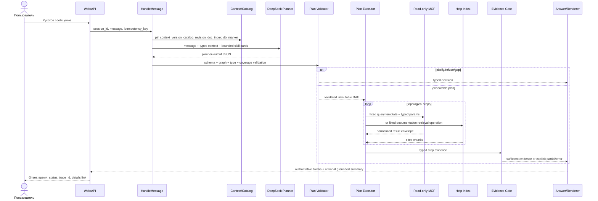

# Жизненный цикл пользовательского запроса

Этот документ задает полный путь от web-сообщения до доказуемого ответа. Все
шаги имеют trace event, входной/выходной contract и конечный deadline.

## 1. Последовательность



## 2. Стадии и транзакционные точки

### 2.1. Прием

`POST /api/v1/sessions/{session_id}/messages` принимает:

```json
{
  "text": "Покажи остатки курток на розничных складах",
  "client_message_id": "018f...",
  "expected_context_version": 7
}
```

API проверяет размер/UTF-8, создает `request_id`, `trace_id`, turn и user message
в одной SQLite transaction. Повтор того же `client_message_id` возвращает
существующий turn. Ответ API: `202 Accepted` с `turn_id`, после чего UI получает
progress через SSE. Ввод остается доступным; для одной сессии выполнение turns
сериализуется, разные сессии могут обрабатываться параллельно.

### 2.2. Pinning состояния

В начале turn фиксируются:

- `session_context_version` и pending clarification, если есть;
- immutable `catalog_snapshot_id/revision` и точные skill versions/checksums;
- версия help index и corpus digest;
- последний проверенный `acceptance_observable_state` marker с revision/digest
  configuration profile, catalog snapshot, documentation index и контрольных
  проекций/агрегатов acceptance suite;
- `turn_time` и timezone `Europe/Moscow`.

Импорт/замена навыка после этой точки виден только следующему turn. Если клиент
прислал устаревший context version, запрос не исполняется: возвращается
`409 CONTEXT_VERSION_CONFLICT`, UI перечитывает сессию и предлагает повтор.

### 2.3. Построение контекста

Planner получает не сырой transcript и не raw MCP, а ограниченный контекст:

```json
{
  "confirmed_facts": [
    {
      "handle": "ctx_01J...",
      "semantic_type": "document.sales_order",
      "presentation": "Заказ 0000-000005 от 12.02.2025",
      "origin_turn_id": "..."
    }
  ],
  "active_filters": [
    {"handle": "ctx_01K...", "semantic_type": "warehouse.kind.retail"},
    {"handle": "ctx_01L...", "semantic_type": "time.moment"}
  ],
  "pending_clarification": null,
  "recent_user_messages": ["..."],
  "context_version": 7
}
```

Полный `_objectRef` хранится в core и не требуется модели. DeepSeek может только
вернуть существующий handle; resolver проверяет его принадлежность сессии,
semantic type и актуальность. Новый mention товара остается text slot и должен
пройти entity-resolution skill.

### 2.4. Shortlist навыков

Shortlist формируется до planner call как объединение независимых сигналов:

1. intent/source boundary (`data`, `documentation`, `mixed`);
2. alias/examples BM25 с учетом опечаток;
3. declared produced fact types;
4. compatible input types и уже доступные context facts;
5. applicability и anti-examples;
6. target compatibility и active catalog revision.

Текстовая близость дает только recall и никогда не подтверждает выбор. В prompt
передается не query text, а card: skill ID/version, purpose, typed inputs,
produced facts, limitations и dependencies. Максимум shortlist задается
конфигурацией (рекомендуется 16). Если validator обнаружил недостающий fact type,
разрешено одно расширение shortlist через fact index и один повтор планирования.

### 2.5. Планирование DeepSeek

DeepSeek возвращает только JSON по `schemas/planner-output.schema.json`:

- `execute`: DAG skill/operator calls;
- `clarify`: один конкретный вопрос и до пяти вариантов;
- `refuse`: только `read_only_request` или `out_of_scope`;
- `capability_gap`: перечень отсутствующих semantic fact types.

В schema отсутствуют query, table, column, MCP tool arguments и произвольный
код. JSON parse/schema error допускает один repair call с кратким списком
validation errors. Вторая ошибка становится `llm_unavailable/contract_error`.

### 2.6. Проверка плана до выполнения

`PlanValidator` повторно, без доверия к утверждениям модели, проверяет:

1. request/context/catalog versions совпадают с pinned snapshot;
2. все skill IDs и версии есть в snapshot и совместимы с базой;
3. каждый binding существует, разрешен parameter contract и совпадает по типу;
4. entity-ref приходит только из context или предыдущего validated step;
5. все ссылки направлены на более ранний step, IDs уникальны, циклов нет;
6. operator входит в allowlist, его operands и units совместимы;
7. для каждого required fact существует producer с нужной cardinality, unit и
   time semantics;
8. required inputs producer-ов доступны из slots/context/предыдущих steps;
9. final outputs покрывают все обязательные requirements;
10. data/documentation boundaries не смешаны без явного mixed plan;
11. list skill имеет pagination contract, default page size 20;
12. неиспользуемые или дублирующие steps отклоняются.

Результат проверки - `CoverageProof`, построенный core. Если не хватает
пользовательского значения, выполняется clarification. Если отсутствует
producer, возвращается capability gap. Никакой MCP call до успешного proof нет.

## 3. Исполнение плана

### 3.1. Skill call

Executor загружает skill из pinned snapshot, разрешает bindings и строит MCP
arguments только из query template и его parameter map. Подстановка строк в
query text запрещена. `like_contains` формирует значение параметра `%...%`, а не
фрагмент запроса. `_objectRef` передается в формате MCP без преобразования в
presentation или поиска по имени.

MCP получает только:

```json
{
  "query": "<exact text from accepted skill revision>",
  "params": {"Номенклатура": {"_objectRef": true, "...": "..."}},
  "limit": 21,
  "include_schema": true
}
```

`21` означает 20 отображаемых строк плюс probe наличия продолжения. Query text,
params и raw response записываются в защищенную diagnostic payload, но не в
обычный application log или chat response.

### 3.2. Documentation retrieval

Documentation skill вызывает локальный индекс с фиксированным corpus,
retrieval engine, filters, top-k и ожидаемыми chunk roles. Результат содержит
текст chunk и citation с `ut-help://11.5.27.56/...#anchor`.

Schema и adapter v1 принимают только `source_kind=built_in_help`; любое другое
значение отклоняется до retrieval. Если grounded consistency pass находит разные
позиции в нескольких фрагментах встроенного корпуса, он возвращает только
ссылки на fact/citation IDs. Core проверяет минимум две разные citations и
создает `documentation_disagreements`; renderer показывает каждую позицию и ее
источник отдельно, не выбирая одну версию как истинную без evidence.

### 3.3. Детерминированные операторы

Операторы принимают только typed facts. `rank` требует measure и направление;
`aggregate` сохраняет unit; `join` соединяет только совместимые identity keys;
`calculate` проверяет размерности и деление на ноль. Каждый производный факт
содержит provenance на исходные fact instance IDs.

### 3.4. Ссылочные объекты

Каноническая identity 1С:

```json
{
  "_objectRef": true,
  "УникальныйИдентификатор": "a1b2c3d4-e5f6-7890-abcd-ef1234567890",
  "ТипОбъекта": "ДокументСсылка.ЗаказКлиента",
  "Представление": "Заказ клиента 0000-000005"
}
```

Identity определяется парой `ТипОбъекта + УникальныйИдентификатор`.
`Представление` только отображается и не участвует в равенстве. Fact получает
business semantic type (`document.sales_order`, `party.customer`), поэтому
договор нельзя передать в parameter клиента даже при похожем представлении.

После успешного ответа только факты, перечисленные output contract как
context-exportable, получают opaque handle и атомарно добавляются в context
ledger. Follow-up заменяет только явно измененный slot; остальные active filters
сохраняются. Ответ на clarification связан с сохраненным unfinished request, а
не планируется как независимый вопрос.

## 4. Нормализация исходов

| Состояние | Условие | Пользовательское поведение |
| --- | --- | --- |
| `success_with_rows` | `success=true`, есть строки, schema и required facts валидны | Показать подтвержденные данные |
| `success_empty` | Успешная корректная выборка, 0 строк | Подтвердить отсутствие по условиям |
| `zero_aggregate` | Успешная aggregate cardinality и подтвержденное значение `0` | Показать ноль с показателем/единицей |
| `partial` | Выполнена только часть required facts/steps или contract требует все страницы | Назвать полученную и отсутствующую часть; не выдавать полный ответ |
| `query_error` | MCP доступен, но `execute_query` вернул `success=false` | Ошибка запроса, trace ID; не «данных нет» |
| `contract_error` | Envelope/schema/types не совпали с принятым контрактом | Контролируемая ошибка навыка, trace ID |
| `mcp_unavailable` | connect/read timeout, protocol/transport failure | Назвать MCP, trace ID, без данных |
| `llm_unavailable` | timeout/HTTP/invalid structured output после policy | Назвать DeepSeek, trace ID; сессию сохранить |
| `documentation_found` | Есть валидные chunks и citations | Ответить со ссылками на help corpus |
| `documentation_empty` | Индекс успешно отработал, подходящих chunks нет | Сообщить, что подтверждение в справке не найдено |

`success_empty` устанавливается только после успешного envelope, schema check и
parameter trace. Один row с `0` не пуст. Один row с `null` трактуется по
`empty_semantics` skill contract, но никогда автоматически как ноль.

Для composite plan:

- required step error делает итог error или partial согласно final coverage;
- optional empty set может продолжить план только при явном `on_empty`;
- промежуточная ссылка на последний документ не может стать final output, если
  required facts требуют его строки, поставщика или задолженность.

## 5. Проверка evidence после выполнения

Каждая колонка преобразуется только через exact `column_bindings` навыка.
Поиск колонок по словам вроде «Сумма» или «Количество» запрещен. Валидатор
проверяет:

- presence/nullability и MCP type каждого required fact;
- cardinality и row identity;
- business semantic type объекта;
- moment для остатков, period для оборотов;
- unit/currency или явный unresolved unit;
- pagination/truncation policy;
- provenance каждого derived fact;
- citation/release/source kind для документации;
- все fact/citation IDs каждой documentation disagreement position и минимум
  две разные citations из встроенного корпуса.

Затем core сопоставляет `FactRequirement` с fact instances и формирует
`evidence.schema.json.coverage`. Только `coverage.sufficient=true` разрешает
обычный полный ответ.

## 6. Формирование ответа

Core сначала создает authoritative renderer manifest: labels, values, units,
period/moment, rows, limit/has-more и citations. Эти блоки не редактирует LLM.

Опциональный второй DeepSeek call получает только manifest и snippets evidence,
а возвращает structured draft из коротких sections с `evidence_ids`. Проверки:

1. каждый section с фактическим утверждением имеет evidence IDs;
2. числа, даты, валюты, номера и entity presentations встречаются в указанном
   evidence либо являются детерминированной форматированной формой;
3. документационный section ссылается на citation;
4. при `documentation_disagreements` draft и renderer показывают все позиции с
   их citations и не объявляют одну разрешенной;
5. draft не меняет outcome и не скрывает partial/error.

При невалидном draft используется deterministic renderer. При недоступности LLM
до планирования ответ `llm_unavailable`; после получения evidence UI может
показать verified blocks с предупреждением, что текстовое резюме недоступно.

Обычный ответ содержит показатель, объект, период/момент, единицу, существенные
условия и limit. Details содержит plan summary, capability/skill IDs и evidence
coverage. Diagnostics дополнительно содержит prompt, query, params и raw MCP.

## 7. Продолжение списков

Default - 20 строк. Skill обязан объявить:

- `prefix` только для заведомого maximum total не более 1000;
- `keyset` для неограниченных списков, со stable sort и cursor bindings;
- `none` для scalar/aggregate/exactly-one.

Core создает `page_*` handle как base64url от 24 байт CSPRNG. Session, turn,
skill/version, normalized parameters, catalog snapshot, database marker и cursor
хранятся только server-side в `page_continuations`. При чтении repository
проверяет handle, session, состояние consumed/expiry и pinned revisions; поля от
клиента не используются как binding. HMAC, подписанный payload и key management
в MVP отсутствуют. «Продолжить» не переинтерпретирует исходный вопрос и не
меняет фильтры. Если marker изменился, старый cursor отклоняется с предложением
выполнить запрос заново. Полная выборка проходит страницами до
`has_more=false` в рамках request deadline и настраиваемого safety cap; при
достижении cap результат `partial`.

## 8. Завершение turn

В одной transaction сохраняются assistant message, outcome, evidence summary,
context exports, pending clarification и новая context version. Trace payloads
могут дописываться до финализации, после чего trace становится immutable.
Ошибка любого stage также завершает turn, сохраняет user message/session и не
останавливает обработку следующих обращений.
